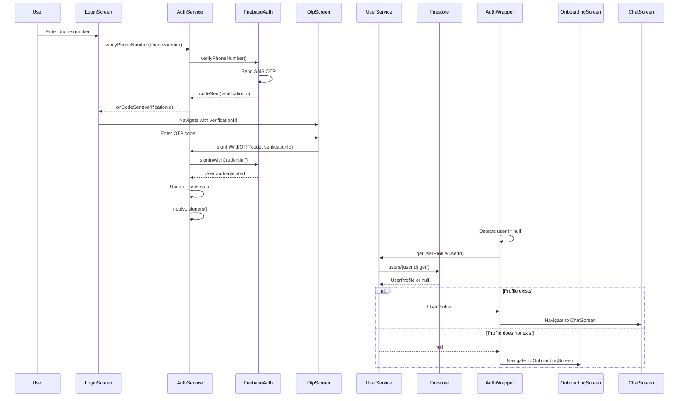
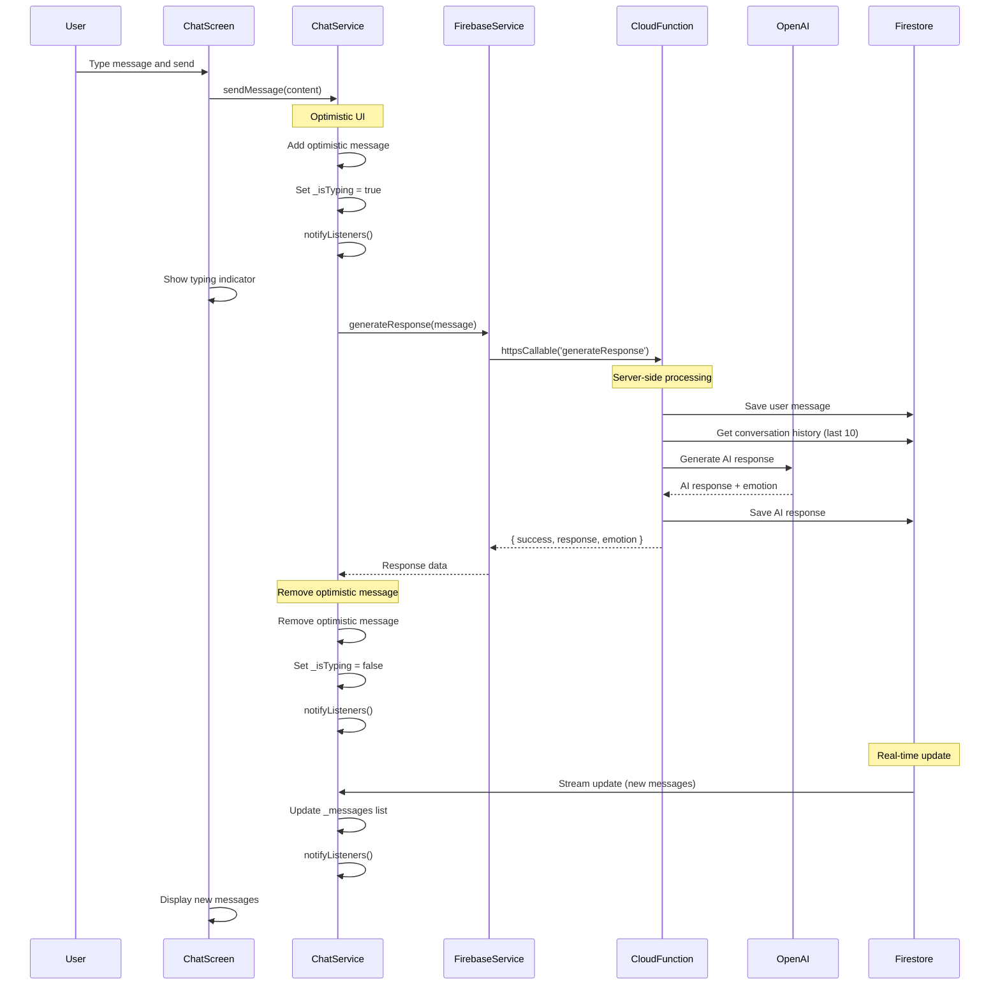
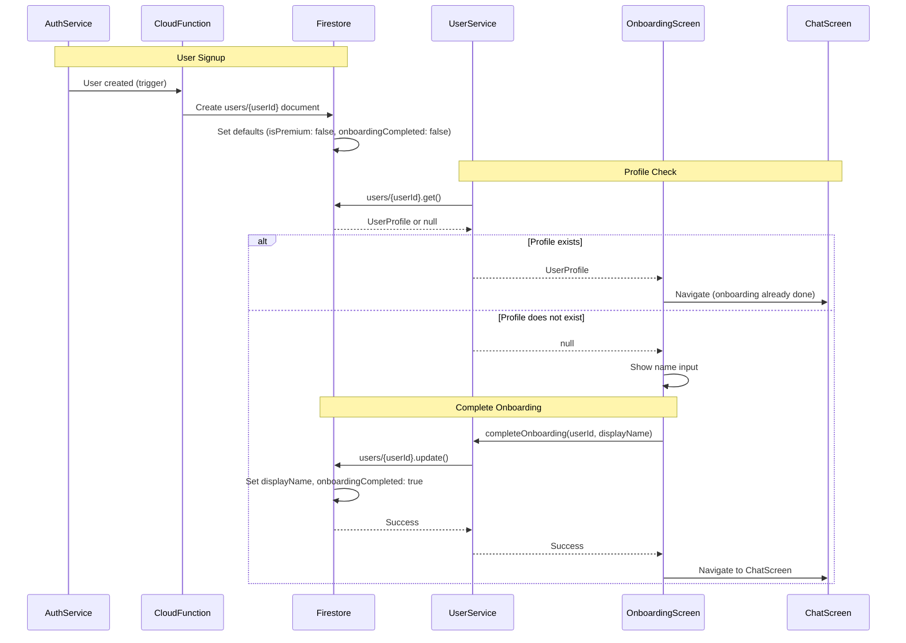
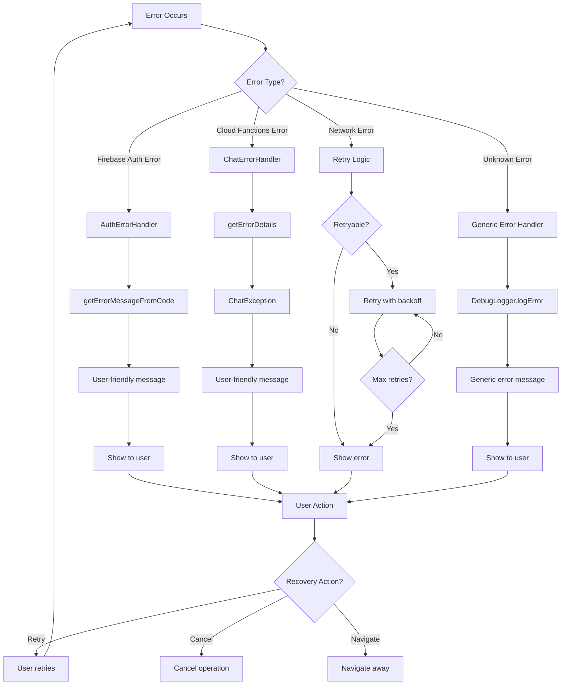
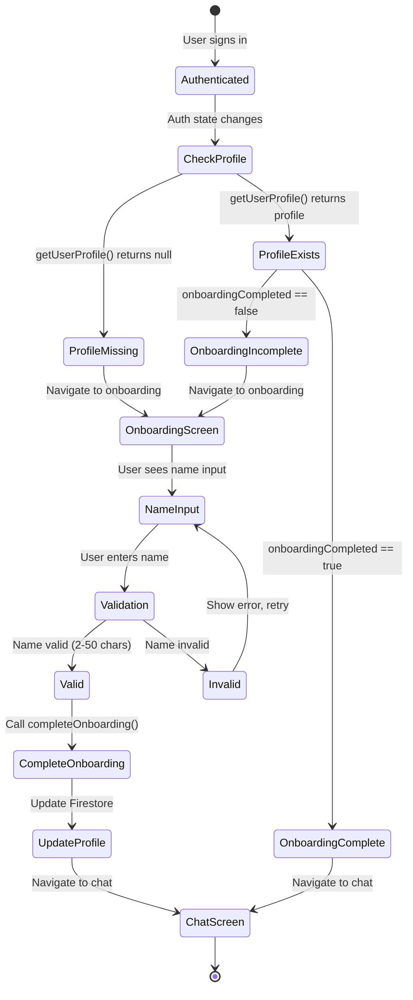
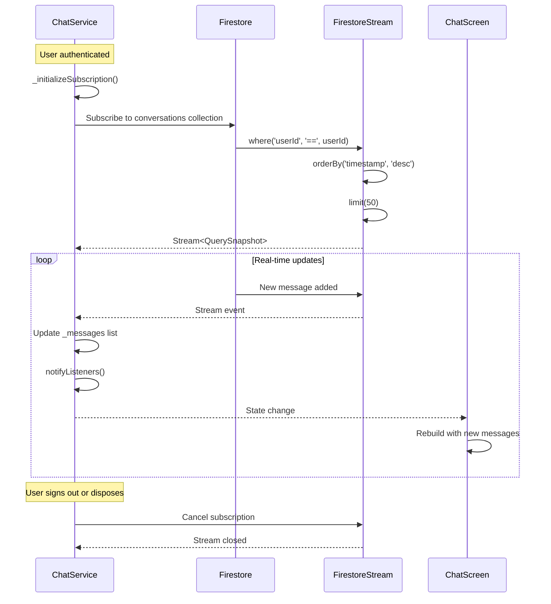
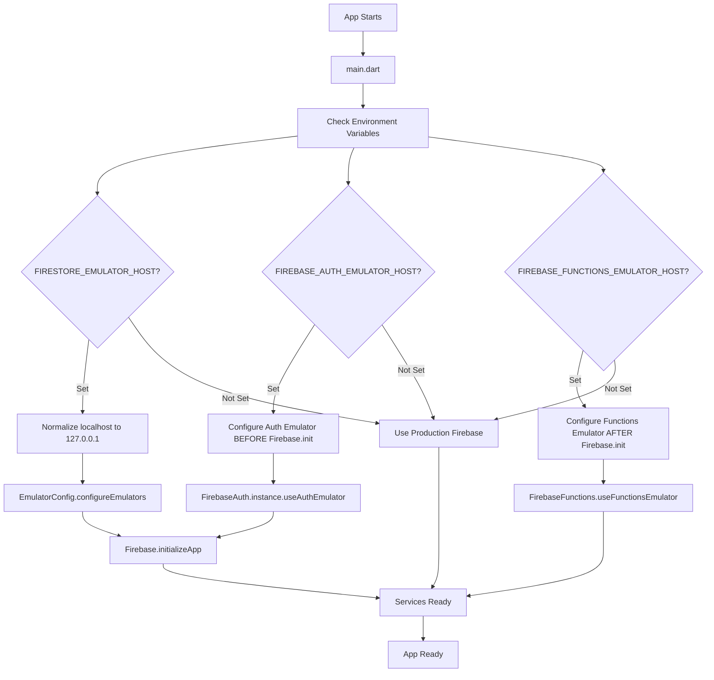
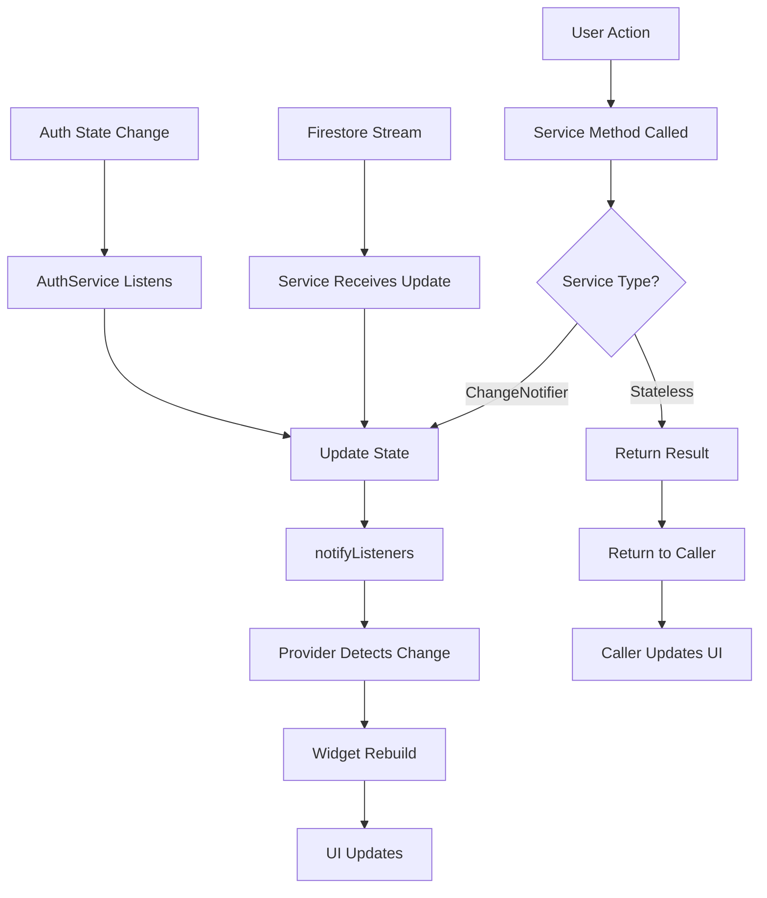

# Data Flows

Complete documentation of all data flows in the AI Girlfriend App.

## Authentication Flow

### Phone Number Entry → OTP Verification → Profile Check → Navigation

### Key Points
- OTP verification happens client-side via Firebase Auth
- User profile check happens after authentication
- Navigation depends on profile existence
- Auth state changes trigger rebuilds via Provider

## Chat Message Flow

### User Input → Cloud Function → AI Response → Firestore → UI Update

### Key Points
- Optimistic UI: User message appears immediately
- Cloud Function saves both user and AI messages
- Real-time updates via Firestore stream
- Retry logic for transient failures
- Typing indicator shown during processing

## User Profile Management Flow

### Profile Creation → Updates → Onboarding Completion

### Key Points
- Profile created automatically on signup (Cloud Function trigger)
- Profile check determines navigation
- Onboarding updates profile with display name
- Profile updates are immediate (no optimistic UI needed)

## Error Handling Flow

### Error Detection → Classification → User-Friendly Message → Recovery

### Key Points
- Errors classified by type (Auth, Chat, Network, Unknown)
- User-friendly messages via error handlers
- Retry logic for transient failures
- All errors logged via DebugLogger
- Privacy: No sensitive data in logs

## Onboarding Flow

### New User → Profile Check → Onboarding → Chat

### Key Points
- Profile check happens immediately after authentication
- Navigation depends on profile existence and onboarding status
- Name validation: 2-50 characters
- Profile update is atomic (single Firestore update)

## Firestore Subscription Flow

### Real-time Message Updates

### Key Points
- Subscription created when ChatService initializes with userId
- Real-time updates via Firestore streams
- Messages limited to 50 most recent
- Subscription cancelled on dispose or sign out
- Automatic UI updates via Provider notifyListeners()

## Emulator Configuration Flow

### Environment Detection → Host Normalization → Service Configuration

### Key Points
- Emulators require explicit environment variables
- No automatic fallback (prevents physical device from connecting to localhost)
- Host normalization: localhost → 127.0.0.1 (iOS Simulator compatibility)
- Auth emulator must be configured BEFORE Firebase.initializeApp()
- Firestore and Functions emulators configured AFTER initialization

## State Management Flow

### Provider State Updates → UI Rebuilds

### Key Points
- ChangeNotifier services (AuthService, ChatService) trigger rebuilds
- Stateless services (UserService, FirebaseService) return results
- Provider automatically rebuilds dependent widgets
- Stream subscriptions trigger state updates
- Auth state changes propagate through Provider
