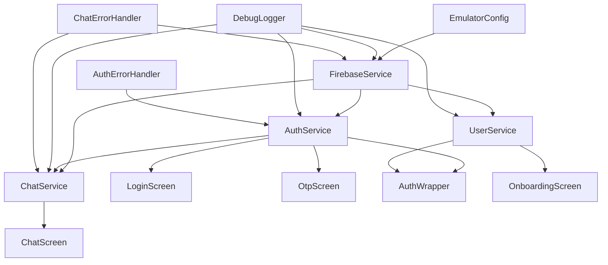

# Service Interactions

Complete mapping of service dependencies and interaction patterns.

## Service Dependency Graph



## Service Descriptions

### FirebaseService
**Type**: Singleton
**Location**: `lib/core/services/firebase_service.dart`

**Dependencies**:
- Firebase packages (firebase_core, firebase_auth, cloud_firestore, cloud_functions)
- EmulatorConfig (for emulator configuration)

**Used By**:
- AuthService
- UserService
- ChatService

**Responsibilities**:
- Provides centralized access to Firebase services
- Configures emulator connections
- Handles Cloud Function calls
- Error handling and logging

**Key Methods**:
- `auth`: Returns FirebaseAuth instance
- `firestore`: Returns FirebaseFirestore instance
- `functions`: Returns FirebaseFunctions instance
- `generateResponse(message)`: Calls Cloud Function for AI response
- `generateVoice(text, voiceId)`: Calls Cloud Function for voice generation

**Interaction Patterns**:
- Singleton pattern ensures single instance across app
- Lazy initialization (checks Firebase.apps.isEmpty)
- Emulator configuration per-instance for Functions

### AuthService
**Type**: ChangeNotifier (Provider)
**Location**: `lib/features/auth/auth_service.dart`

**Dependencies**:
- FirebaseService
- AuthErrorHandler
- DebugLogger
- EmulatorConfig

**Used By**:
- LoginScreen
- OtpScreen
- AuthWrapper (in main.dart)
- ChatService (indirectly, via user state)

**State**:
- `_user`: Current authenticated user
- `_verificationId`: OTP verification ID
- `_resendToken`: Token for resending OTP
- `_lastPhoneNumber`: Last verified phone number

**Key Methods**:
- `verifyPhoneNumber(phoneNumber, callbacks)`: Initiates phone verification
- `signInWithOTP(smsCode, verificationId?)`: Verifies OTP and signs in
- `resendOTP(callbacks)`: Resends OTP code
- `signOut()`: Signs out current user

**Interaction Patterns**:
- Listens to Firebase Auth state changes
- Notifies listeners on state changes
- Handles OTP verification flow
- Provides user state to other services

### UserService
**Type**: Stateless Service
**Location**: `lib/core/services/user_service.dart`

**Dependencies**:
- FirebaseService
- DebugLogger

**Used By**:
- OnboardingScreen
- AuthWrapper (for profile check)

**Key Methods**:
- `getUserProfile(userId)`: Retrieves user profile from Firestore
- `ensureUserProfile(userId, phoneNumber)`: Creates profile if missing
- `updateUserProfile(userId, updates)`: Updates profile fields
- `completeOnboarding(userId, displayName)`: Completes onboarding

**Interaction Patterns**:
- Stateless: No internal state, returns results
- Direct Firestore access via FirebaseService
- Used for profile CRUD operations

### ChatService
**Type**: ChangeNotifier (Provider)
**Location**: `lib/features/chat/chat_service.dart`

**Dependencies**:
- FirebaseService
- DebugLogger
- AppConstants

**Used By**:
- ChatScreen

**State**:
- `_messages`: List of messages
- `_isTyping`: Typing indicator state
- `_userId`: Current user ID
- `_messagesSubscription`: Firestore stream subscription

**Key Methods**:
- `sendMessage(content)`: Sends message with optimistic UI
- `_subscribeToMessages()`: Subscribes to Firestore message stream
- `updateUserId(newUserId)`: Updates subscription for new user

**Interaction Patterns**:
- Depends on AuthService for user state (via ChangeNotifierProxyProvider)
- Optimistic UI: Adds message immediately, removes on success
- Real-time updates via Firestore stream
- Retry logic for transient failures

## Provider Setup (main.dart)

```dart
MultiProvider(
  providers: [
    // Singleton FirebaseService
    Provider<FirebaseService>.value(value: firebaseService),
    
    // AuthService (depends on FirebaseService)
    ChangeNotifierProvider<AuthService>(
      create: (_) => AuthService(firebaseService),
    ),
    
    // UserService (depends on FirebaseService)
    Provider<UserService>(
      create: (_) => UserService(firebaseService),
    ),
    
    // ChatService (depends on FirebaseService and AuthService)
    ChangeNotifierProxyProvider<AuthService, ChatService>(
      create: (_) => ChatService(firebaseService, null),
      update: (_, auth, previousChat) {
        // Recreate if userId changed
        if (previousChat != null && previousChat.userId == auth.user?.uid) {
          return previousChat;
        }
        return ChatService(firebaseService, auth.user?.uid);
      },
    ),
  ],
)
```

### Key Points
- FirebaseService is a singleton (provided as value)
- AuthService is a ChangeNotifier (state management)
- UserService is stateless (no ChangeNotifier)
- ChatService is a ChangeNotifierProxyProvider (depends on AuthService)

## Service Initialization Order

1. **FirebaseService**: Created as singleton in main.dart
2. **Firebase.initializeApp()**: Initializes Firebase
3. **EmulatorConfig.configureEmulators()**: Configures emulators (if env vars set)
4. **Provider Setup**: Creates all services
5. **AuthService**: Subscribes to auth state changes
6. **ChatService**: Initializes when userId is available

## Service Communication Patterns

### Direct Method Calls
- **Pattern**: Service A calls method on Service B
- **Example**: `ChatService.sendMessage()` → `FirebaseService.generateResponse()`
- **Use Case**: Synchronous operations, immediate results

### Provider State Changes
- **Pattern**: Service updates state, Provider notifies listeners
- **Example**: `AuthService` updates `_user`, `AuthWrapper` rebuilds
- **Use Case**: State management, UI updates

### Firestore Streams
- **Pattern**: Service subscribes to Firestore stream, receives real-time updates
- **Example**: `ChatService` subscribes to `conversations` collection
- **Use Case**: Real-time data synchronization

### Callbacks
- **Pattern**: Service accepts callbacks for async operations
- **Example**: `AuthService.verifyPhoneNumber()` accepts `onCodeSent` callback
- **Use Case**: Async operations, event-driven flows

## Error Propagation

### Error Flow
```
Service Method → Exception → Error Handler → User-Friendly Message → UI Display
```

### Error Handlers
- **AuthErrorHandler**: Converts Firebase Auth errors to user messages
- **ChatErrorHandler**: Converts Cloud Functions errors to user messages
- **DebugLogger**: Logs all errors with structured data

### Error Handling Pattern
1. Service catches exception
2. Logs error via DebugLogger
3. Converts to user-friendly message via error handler
4. Throws custom exception (ChatException) or returns error
5. UI displays error message

## Service Lifecycle

### Service Creation
- Services created during Provider setup
- Singleton services (FirebaseService) created once
- ChangeNotifier services created per Provider scope

### Service Disposal
- ChangeNotifier services dispose subscriptions in `dispose()`
- Firestore stream subscriptions cancelled
- Auth state subscriptions cancelled

### Service Updates
- ChatService recreated when userId changes (via ChangeNotifierProxyProvider)
- AuthService updates on auth state changes
- Services update state via `notifyListeners()`

## Best Practices

### Service Design
- Single Responsibility: Each service has one clear purpose
- Dependency Injection: Services receive dependencies via constructor
- Stateless When Possible: Use stateless services when no state needed
- ChangeNotifier for State: Use ChangeNotifier when state changes affect UI

### Error Handling
- Always log errors via DebugLogger
- Convert to user-friendly messages
- Preserve original error for debugging
- Handle retryable errors with retry logic

### State Management
- Use Provider for state that affects UI
- Use stateless services for operations without UI state
- Minimize state: Only store what's needed
- Dispose subscriptions: Prevent memory leaks

### Testing
- Mock dependencies for unit tests
- Test service methods in isolation
- Test error handling paths
- Test state updates and notifications
